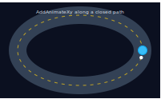
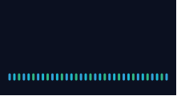
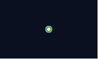
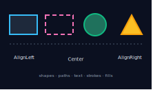

# FluentSvg

A minimal, dependency-free fluent builder for generating SVG documents in .NET.

It does one thing: let you assemble an SVG out of shapes, paths, text, clip paths and
SMIL animations with a small fluent API, then render it to a string or a file. No
third-party dependencies — points are plain `System.Numerics.Vector2`.

```csharp
dotnet add package FluentSvg
```

## Gallery

All of these are real SVGs generated by [`samples/Gallery`](samples/Gallery/Program.cs)
and are animated — open them to see the motion (the stills below loop in a browser).

<p align="center">
  <br>
  <em>A car following a closed path with <code>AddAnimateXy</code> — body + heading nose.</em>
</p>

<p align="center">
  
  
  
</p>

<p align="center">
  <em>Orbits (looping <code>AddAnimateXy</code>) &middot; a wave (<code>AddAnimateLine</code>) &middot;
  pulsing rings (animating <code>r</code> and <code>stroke-opacity</code>).</em>
</p>

<p align="center"></p>

Regenerate them with:

```bash
dotnet run --project samples/Gallery -- gallery
```

## Quick start

```csharp
using System.Numerics;
using FluentSvg;

var svg = new Svg("hello.svg", title: "Demo");

svg.AddRectangleFromTo(new Vector2(0, 0), new Vector2(100, 60))
   .SetFill("CornflowerBlue")
   .SetStroke("navy", 2);

svg.AddCircle(new Vector2(50, 30), 20).SetFill("white");

svg.AddText(new Vector2(50, 30), "Hi").Center().SetFill("black");

svg.SaveToFile();              // writes hello.svg next to the working directory
```

Prefer the markup as a string?

```csharp
string xml = new Svg("ignored.svg").AddCircle(new Vector2(10, 10), 5).Svg.Render();
```

## What's in the box

- **Shapes** — `AddCircle`, `AddRectangleFromTo` / `AddRectangleSized` / `AddRectangleCenterSized`, `AddLine`.
- **Paths** — `AddPath(...)` (multiple overloads, including integer `Vector2I` points), `Path.SetClosed()`, and `Svg.DecodePath(d)` to parse an SVG path `d` string back into point lists.
- **Text** — `AddText` with a full set of alignment helpers (`Center`, `AlignTopLeft`, `AlignBottomCenter`, ...).
- **Clip paths** — rectangle, triangle, and "everything except this triangle" variants.
- **Grouping** — `PushGroup()` / `PopGroup()` to wrap items in `<g>`, plus `AddSvg()` for nested `<svg>`.
- **Animation** — SMIL `AddAnimate`, `AddAnimateXy`, `AddAnimateLine`.
- **Styling** — fluent extension methods: `SetFill`, `SetStroke`, `SetStrokeWidth`, `SetStrokeDashArray`, `SetFontSize`, `SetFillOpacity`, `RotateAroundPoint`, etc. (also accept `System.Drawing.Color`).

The view box and `width`/`height` are computed automatically from the geometry's extents
(plus a configurable `Margin`); pass an explicit `size` to the constructor to override.

## Notes

- All numeric formatting is invariant-culture, so output is stable regardless of locale.
- `Svg.Bob(...)` is a convenience factory that targets a scratch `bob.svg` in the system temp directory — handy for quick "dump and look at it" debugging.

## License

MIT
